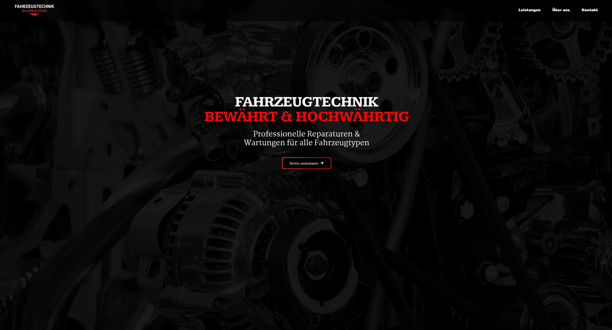

# Mechanic Website

A modern, responsive one-page website built for a local mechanic business. The site provides essential information about the company, services, and contact details. Designed with a sleek user experience using **React**, **TailwindCSS**, and **GSAP** for animations.

---

## 🚗 Table of Contents

- [Introduction](#introduction)
- [Features](#features)
- [Tech Stack](#tech-stack)
- [Folder Structure](#folder-structure)
- [👥 Contributor](#-contributor)
- [Contact](#contact)

---

## Introduction

Mechanic Website is a modern, visually appealing one-page web solution for local mechanic businesses. It helps businesses showcase their services, company background, and contact information to attract and engage customers. The site is designed for great user experience, performance, and seamless animations.

It emphasizes:

- Clear service information
- Easy-to-find contact details
- Smooth animations for a professional feel


---

## Features

- 📱 Responsive design (works across devices)
- 🎨 Modern UI styled with TailwindCSS and Styled Components
- 🎥 Smooth animations powered by GSAP & Framer Motion
- 🔗 React Router for navigation handling
- 📌 Contact details easily accessible

---

## Tech Stack

- **Frontend:** React, Vite, TailwindCSS, Styled Components
- **Animations:** GSAP, Framer Motion
- **Icons & UI:** Heroicons, React Icons
- **Routing & Responsiveness:** React Router, React Responsive
- **Tooling: ESLint, Vite** ESLint, Vite

---


## Folder Structure

```
Mechanic_Website/
├── public/
├── src/
│   ├── components/
│       ├── Animation/
│       └──...
│   ├── App.jsx
│   ├── Impressum.jsx
│   ├── PrivacyPolicy.jsx
│   ├── index.css
│   └── main.jsx
├── index.html
├── tailwind.config.js
├── package.json
└── README.md
```

---

## 👥 Contributor

- **JoHoe11** — Developer
  
---

## Contact

For questions or feedback, please contact [JoHoe11](https://github.com/JoHoe11).
```
